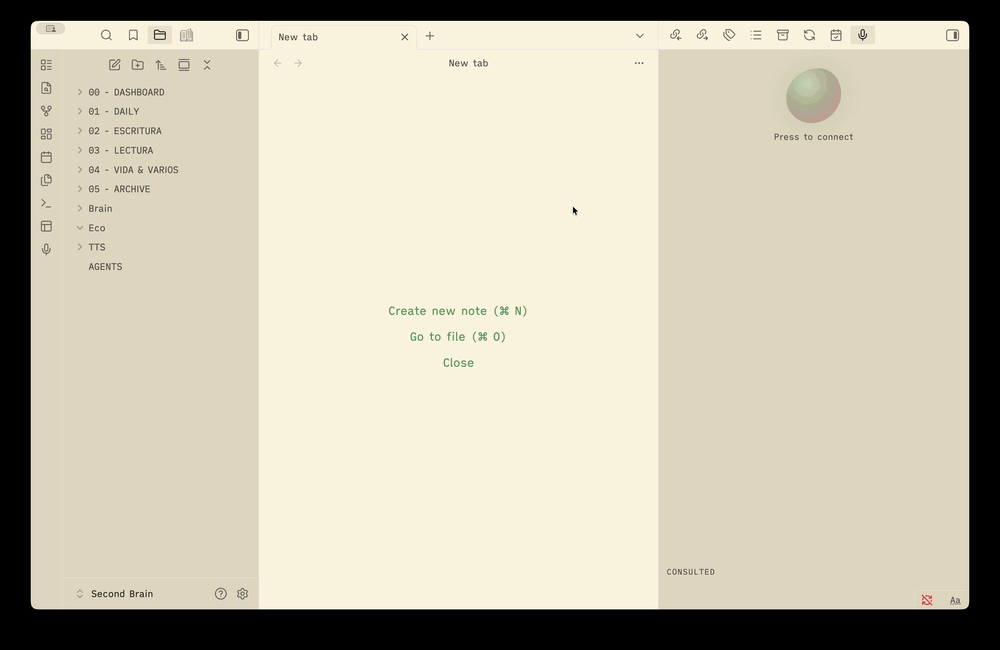

# voz-notas

**Talk to your Obsidian notes by voice.** A hands-free, conversational voice
assistant that lives in a side panel, searches and reads your vault, and answers
out loud — powered by the OpenAI Realtime API.

> _"voz-notas" is Spanish for "voice-notes"._

<!-- Record a short clip of the panel while you talk to your notes and drop it here:

-->

> 🎥 **Demo GIF coming** — the liquid orb reacts to your voice while the transcript
> and the notes it consulted show up beside it.

---

## What it does

Start a session and just talk. The assistant can:

- **Search & read** your notes, open one in the foreground, or use the note you
  already have open.
- **Follow the graph** — read a note's `[[links]]`, its outline (headings), your
  `#tags`, and find notes by tag or by filename.
- **Write, with confirmation** — append to the current note, insert text at the
  cursor, or create a new note (in a fixed folder), always asking first.
- **Think harder when asked** — it can delegate opinions and deeper analysis to a
  stronger reasoning model.
- **Learn your preferences** — tell it "from now on, always…" and it appends the
  rule to your `AGENTS.md`, which is merged into its instructions next time.

The side panel shows a voice orb that reacts to whoever is talking, the live
transcript (both sides), and the list of notes it consulted (clickable).

## How it works

- **Voice** is a direct WebRTC connection from Obsidian to the OpenAI Realtime
  API — low latency, no server in between.
- **Your notes never leave your machine as a whole.** The assistant reads your
  vault locally; only your spoken audio and the **snippets it needs to answer a
  question** are sent to OpenAI to generate the reply.
- **Bring your own key (BYOK).** Your OpenAI API key is stored locally in the
  vault (`data.json`) and only used to start sessions. There is no backend and no
  account.

Desktop only for now (it needs the microphone and WebRTC).

## Install (manual, while it's early)

1. Download `main.js`, `manifest.json`, and `styles.css` from a release.
2. Put them in `<your vault>/.obsidian/plugins/voz-notas/`.
3. Reload Obsidian and enable **voz-notas** in _Settings → Community plugins_.

## Setup

1. Open **Settings → voz-notas**.
2. Paste your **OpenAI API key**.
3. (Optional) Pick the **interface language** (English / Español) and the
   **reasoning model** used by the "think" tool.

## Use

- Click the **mic icon** in the left ribbon (or the orb in the panel) to start.
- **Talk.** Ask about your notes, ask it to open or read something, or dictate a
  new note.
- **Click the orb** while live to mute/unmute; click the mic icon again to end.

The spoken language follows your settings by default, and you can switch mid-
conversation just by speaking another language.

## Settings

| Setting | What it does |
|---|---|
| **Language** | Language of the plugin interface (English / Español). |
| **OpenAI API key** | Stored locally; only sent to OpenAI to start a session. |
| **Reasoning model** | Stronger model the "think" tool uses for opinions / analysis. |
| **Instructions file** | A Markdown file (default `AGENTS.md`) merged into the assistant's instructions. |

## Build from source

```bash
npm install
npm run build   # bundles src/ → main.js
```

For development, symlink the repo into your vault's plugins folder so a rebuild
updates the plugin in place.

## Status

Early and evolving. Feedback on which tools and graph features would be most
useful is very welcome — open an issue.
